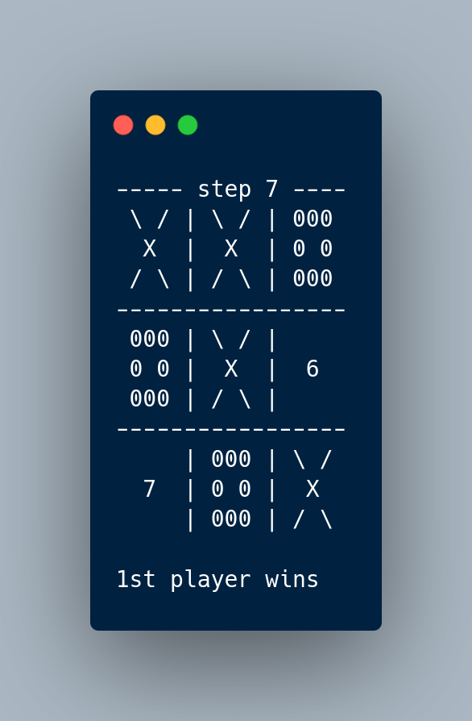

# tic-tac-toe
my first t-t-t on c


You can run this in two ways:

1. Download bin-file and run in console:
```bash 
./tic-tac-toe
```

2. Compile the .c file and run bin-file:
```bash 
gcc tic-tac-toe.c -g -o t-t-t
./t-t-t
```